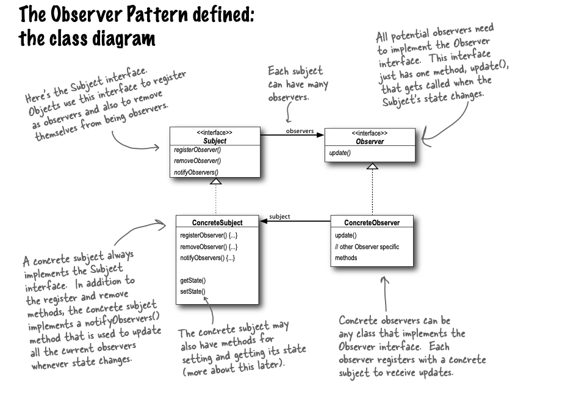

# Observer Pattern
 The Observer Pattern defines a one-to-many dependency between objects so that when one object changes state, all of its dependents are notified and updated automatically.
 

### Example

The weather station will be based on WeatherData object, which tracks current weather conditions (temperature, humidity, and barometric pressure).

Weʼd like for you to create an application that initially provides three display elements: current conditions, weather statistics and a simple forecast, all updated in real time as the WeatherData object acquires the most recent measurements.

Further, this is an expandable weather station. We want to release an API so that other developers can write their own weather displays and plug them right in.
