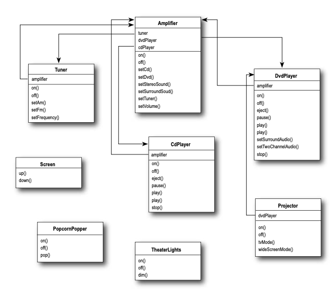
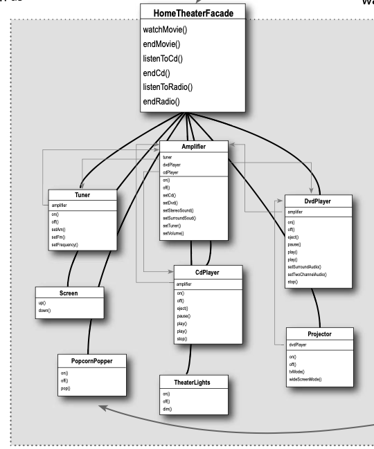

# Facade Pattern

The Facade Pattern provides a unified interface to a set of interfaces in a subsystem.

Facade defines a higher- level interface that makes the subsystem easier to use.


### Example

We have assembled a killer system complete with a DVD player, a projection video system, an automated screen, surround sound and even a popcorn popper.



Watching a movie (the hard way)
Pick out a DVD, relax, and get ready for movie magic. Oh, there’s just one thing – to watch the movie, you need to perform a few tasks:
```
1. Turn on the popcorn popper
2. Start the popper popping 
3. Dim the lights
4. Put the screen down
5. Turn the projector on
6. Set the projector input to DVD
7. Put the projector on wide-screen mode 
8. Turn the sound amplifier on
9. Set the amplifier to DVD input 
10. Set the amplifier to surround sound 
11. Set the amplifier volume to medium 
12. Turn the DVD Player on 
13. Start the DVD Player playing
```

Let’s check out those same tasks in terms of the classes and the method calls needed to perform them:
```
popper.on(); 

popper.pop();

lights.dim(10);

screen.down();

projector.on(); 

projector.setInput(dvd);

projector.wideScreenMode();

amp.on();

amp.setDvd(dvd);

amp.setSurroundSound();

amp.setVolume(5);

dvd.on(); 

dvd.play(movie);
```

But there’s more... 
1. When the movie is over, how do you turn everything off? Wouldn’t you have to do all of this over again, in reverse? 
2. Wouldn’t it be as complex to listen to a CD or the radio? 3.
3. If you decide to upgrade your system, you’re probably going to have to learn a slightly different procedure.

